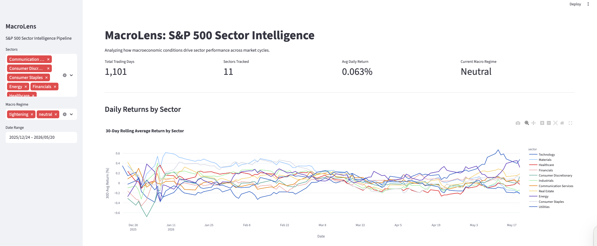
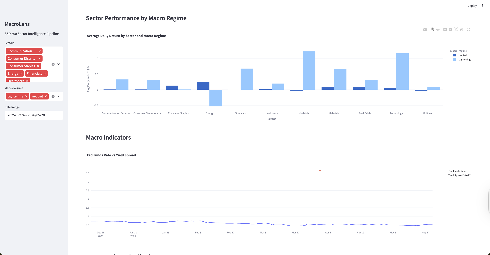

# MacroLens: S&P 500 Sector Intelligence Pipeline

**Macro-Driven Sector Analytics** | Python · Apache Airflow · dbt · PostgreSQL · Streamlit · Docker

---

## Overview

MacroLens answers a specific question: which S&P 500 sectors outperform or underperform depending on what the Fed is doing? It pulls daily ETF price data and monthly macro indicators, joins them, classifies each trading day into a macro regime, and lets you explore sector performance visually across those regimes.

The pipeline runs automatically every weekday at 6am via Airflow. Data flows from two public APIs through validation, into PostgreSQL, through dbt transformations, and into a Streamlit dashboard.

---

## Architecture

Alpha Vantage API + FRED API → Python ingestion → PostgreSQL (raw tables) → dbt (staging → intermediate → mart) → Streamlit + Plotly Dashboard

Airflow DAG orchestrates the full pipeline. A validation layer logs pass/fail results to a validation_log table before any data is loaded.

**Stack:** Python · Apache Airflow (astro-cli) · dbt · PostgreSQL · Streamlit · Plotly · Docker · GitHub Actions

---

### Data Sources

| Source | Description |
|--------|-------------|
| Alpha Vantage | Daily OHLCV prices for 11 S&P 500 sector ETFs — XLK, XLF, XLV, XLE, XLI, XLP, XLY, XLU, XLB, XLRE, XLC. 25 requests/day on free tier. |
| FRED | 5 macroeconomic indicators from 2010 to present — Fed Funds Rate, CPI, Unemployment Rate, 10Y-2Y Yield Spread, GDP. No meaningful rate limit. |

---

## dbt Model Layers

| Layer | Models | Purpose |
|-------|--------|---------|
| Staging (stg_) | 2 models | Clean raw data, add daily_return_pct, standardize column names |
| Intermediate (int_) | 1 model | Nearest-date join of ETF prices to macro indicators with forward-fill for monthly FRED gaps |
| Mart (mart_) | 1 model | Macro regime classification and 30-day rolling average return per sector using window functions |

---

## Macro Regime Classification

Each trading day is classified based on the Fed Funds Rate and 10Y-2Y yield spread:

| Regime | Condition |
|--------|-----------|
| Restrictive | Fed rate >= 5% and yield spread < 0 |
| Tightening | Fed rate >= 3.5% and yield spread >= 0 |
| Expansionary | Fed rate < 2% and yield spread >= 0 |
| Recovery | Fed rate < 2% and yield spread < 0 |
| Neutral | All other conditions |

---

## Key Insights

- During the tightening regime (December 2025 through March 2026, Fed rate >= 3.5%), Consumer Discretionary and Industrials outperformed while Technology and Healthcare saw negative 30-day rolling returns, consistent with rate-sensitive growth sectors underperforming in elevated rate environments
- The yield spread remained positive throughout the observed period (0.5 to 1.0%), signaling no inversion despite elevated Fed rates near 3.6 to 4.3%, consistent with a soft landing scenario
- Sector return dispersion was highest in January 2026, with a 1.2% spread between the best and worst performing sectors, suggesting macro uncertainty was driving rotation between sectors
- Energy was the most volatile sector on a 30-day rolling basis across both regimes, consistent with its sensitivity to oil price swings and geopolitical factors

---

## Dashboard

Two interactive views built with Streamlit + Plotly, querying dbt mart tables directly via PostgreSQL connector.

---

**Daily Returns by Sector**
30-day rolling average return by sector with macro regime overlay. Sidebar filters for sector, regime, and date range.



---

**Sector Performance by Macro Regime**
Average daily return by sector grouped by macro regime. Reveals which sectors outperform or underperform under different Fed policy environments.



---

## Pipeline

The Airflow DAG runs every weekday at 6am with 2 automatic retries and a 5 minute retry delay:

ingest_alpha_vantage → ingest_fred → validate → load → dbt_run → dbt_test

The validation task runs row count, null, and range checks across all source tables before anything is loaded to PostgreSQL.

---

## Project Structure

```
macrolens/
├── .github/workflows/       # GitHub Actions CI pipeline
├── dags/                    # Airflow DAG definition
├── dashboard/               # Streamlit app and Dockerfile
├── dbt/macrolens/           # dbt project
│   └── models/
│       ├── staging/         # stg_sector_prices, stg_macro_indicators
│       ├── intermediate/    # int_sector_macro_joined
│       └── mart/            # mart_sector_performance
├── ingestion/               # fetch_alpha_vantage.py, fetch_fred.py
├── scripts/                 # init_db.py, schema.sql, seed.sql
├── tests/                   # pytest unit tests
├── validation/              # validate.py with logging to validation_log
├── .env.example
└── docker-compose.yml
```

---

## Running Locally

**Prerequisites:** Docker Desktop, Python 3.11+, Alpha Vantage API key, FRED API key

**Run the dashboard with Docker (recommended):**

```bash
git clone https://github.com/sloanatkins/macrolens.git
cd macrolens
docker-compose up --build
```

Dashboard available at localhost:8501. The database is automatically seeded with real data on first startup.

**Run the full pipeline:**

```bash
cp .env.example .env
pip install -r requirements.txt
python scripts/init_db.py
python ingestion/fetch_fred.py
python ingestion/fetch_alpha_vantage.py
python validation/validate.py
cd dbt/macrolens && dbt run && dbt test
cd ../.. && streamlit run dashboard/app.py
```

**Run Airflow:**

```bash
astro dev start
```

Airflow UI available at localhost:8080. The macrolens_pipeline DAG runs every weekday at 6am or can be triggered manually.

---

## Key Technical Decisions

**ELT pattern:** Raw data lands in PostgreSQL unchanged. All transformation happens inside the warehouse with dbt. If transform logic changes, rerun dbt — no re-ingestion needed.

**Forward-fill for macro data:** FRED releases monthly indicators, but ETF prices are daily. The intermediate model uses a nearest-date join with forward-fill to attach the most recent available macro observation to each trading day.

**Validation before load:** Every pipeline run validates row counts, nulls, and value ranges before loading to PostgreSQL. Results are logged to a validation_log table so failures are traceable without digging through logs.

---

## Environment Variables

Copy .env.example to .env and fill in your values:
```
ALPHA_VANTAGE_API_KEY=your_key_here
FRED_API_KEY=your_key_here
POSTGRES_HOST=localhost
POSTGRES_PORT=5432
POSTGRES_DB=macrolens
POSTGRES_USER=your_username
POSTGRES_PASSWORD=
```

---

<i>Sloan M. Atkins · University of Miami · CS + Mathematics, Class of 2027</i><br>
<i>Data Engineering Portfolio · Project 1 of 4</i>